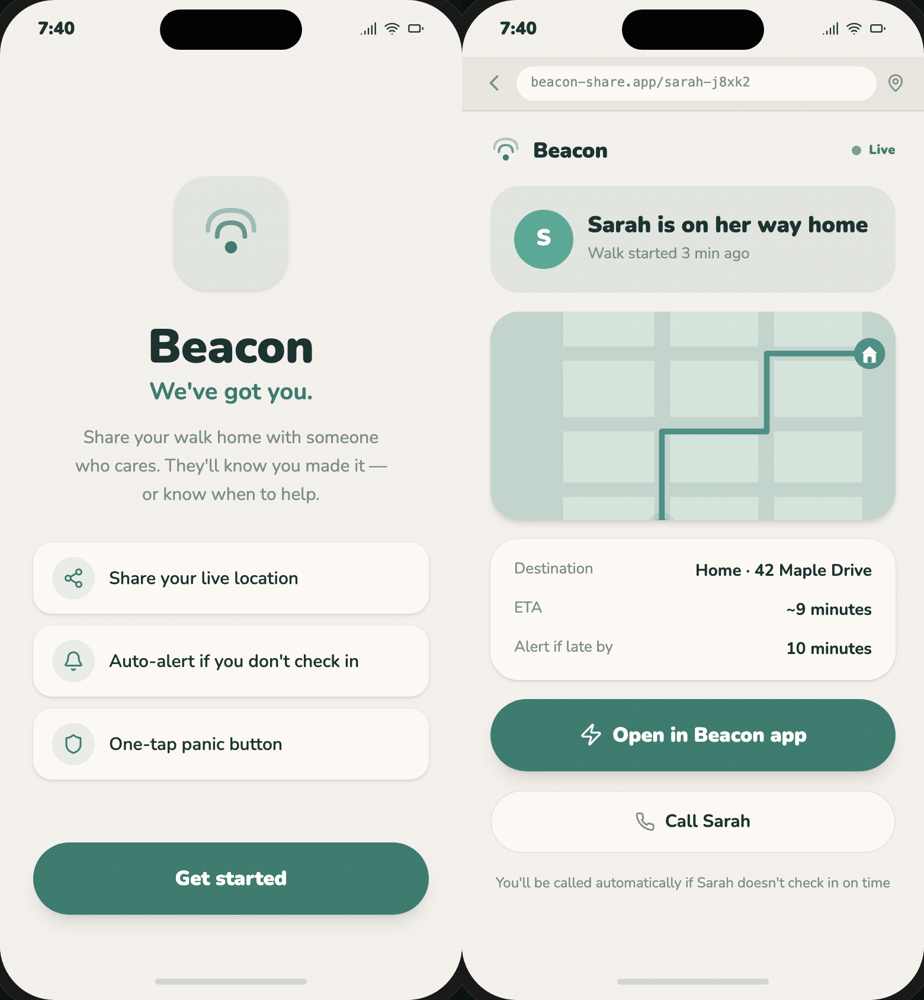

# Beacon

Beacon is an app for peace of mind. The idea is simple: you share your location live, drop checkpoints, and ~~even send heart rate data~~ to the people you trust. So they always know you're okay, and if something's off, they can move fast.



Left: Sarah's phone. Right: Mom's phone (the contact). When Sarah hits panic, Mom sees an emergency alert in real time.

## Why Beacon

Think about it for a second. Almost everyone has that one person who really wants to know when they're in trouble. Could be a parent, a partner, a roommate. The problem is, staying in touch while you're out on the road, on a night out, or walking home alone usually means typing "I'm here" or "almost home" by hand. Easy to forget. And worse, when it's an actual emergency, forget about typing, you might not even be able to reach your phone.

That's where Beacon comes in. It runs quietly in the background, giving the people you trust a way to keep an eye on you and reach you, without you having to check in manually all the time. And when things get really tense, there's a quick way to call for help even if you can't type anything.

Honestly, to me this kind of feature should already be standard. But oh well.

## Who it's for

- People who want their parents (or anyone) to know they got home safe
- Solo travelers, commuters, and folks working night shifts
- Anyone who needs a fast and simple way to raise an alarm when something's wrong
- People with a smartwatch who want safety features that don't require grabbing their phone first

## Main features

**Live location sharing**
Share your real-time location with one or more trusted people. It can run continuously for a set window (say, during your commute home), or through a one-tap link that the recipient doesn't even need to install the app for.

**Checkpoints**
Set an arrival time or a route you're planning to take. If you don't check in by the deadline, or you drift way off course, your contacts get notified automatically. Super easy.

**Panic button**
One quick trigger, whether from inside the app, or your smartwatch (PROTOTYPE). One press and all your trusted contacts instantly get your location, and where possible, a direct line opens up so they can reach you.

**Heartbeat (smartwatch-PROTOTYPE)**
Passively track vitals through a connected smartwatch. Weird signals, like your heart rate spiking at the same time your body suddenly goes still, or what looks like a fall or a crash, can trigger an alert to your contacts without you having to do a thing.

**Trusted contacts**
Add the people you want watching over you, using their phone number or WhatsApp. They don't have to install Beacon to receive alerts or a location link. But yeah, the experience is way nicer if they've got the app too.

## How it works, roughly

1. You add two trusted contacts.
2. You pick how you want to be visible. Could be a live-tracked trip, a scheduled checkpoint, or just having the panic button and heartbeat monitoring on standby.
3. If something looks off, whether you missed a checkpoint, hit the panic button, or your vitals show signs of a fall, your contacts get notified right away with your location and the situation.
4. Your contacts can respond immediately, whether they have Beacon or not.

## Tech stack

This is a demo that actually runs, not just a mockup. Here's roughly what's inside:

**Frontend**

- React 18 with TypeScript
- Vite for bundling and the dev server
- Plain CSS, no fancy frameworks

**Backend**

- Node plus Express, written in TypeScript and run through `tsx`
- WebSocket (`ws`) for syncing location and sessions in real time
- The session store is still in-memory, so there's no database yet
- `qrcode` for generating scannable share links

**Testing**

- Vitest, Testing Library, and jsdom for unit tests
- Playwright for end-to-end

## How to run it

```bash
npm install
npm run dev
```

`npm run dev` fires up the API server and the web client together. If you want to test:

```bash
npm test        # unit tests
npm run test:e2e  # end-to-end
```

## Project status

Still early days. Feature scope, priorities, and the technical architecture aren't all final yet, so expect things to change. I'll keep updating this README as the decisions get clearer.

## Contributing

Not open for outside contributions yet. Details will follow once the project hits a more serious implementation stage.
